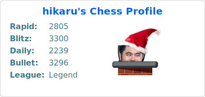
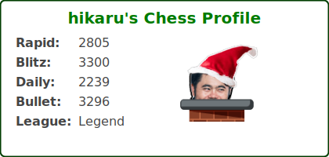

<div align="center">
    <h1>Chess Stats Card</h1>
    Display your chess.com rating on your GitHub profile README.
</div>

## ⚡ Quick setup

1. Star this repo 😁
2. Place the code below in you repo and replace username with your own.
```

```

It is recommended to self-host the project more better reliability. See Deploying it on your own for more details.

## 🔧 Options

The user field is the only required option. All other fields are optional.

| Parameter | Type     | Description                                                              | Example   |
| :-------: | :------: | :----------------------------------------------------------------------- | :-------: |
|`user`     | `string` | Your Chess.com username                                                  | [picture] |
|`theme`    | `string` | Card theme – available themes: light, dark, midnight, [etc...](#-themes) | [picture] |

## 🎨 Themes

All cards themes are set to default by default. Here are a few themes that you can do. 


<details>
<summary> All themes </summary>
Imma do the rest later

| | |
| :---: | :---: | 
| `default`  | `transparent`  |
| `shadow_red`  | `shadow_green`  |

</details>