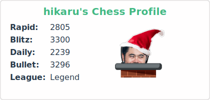
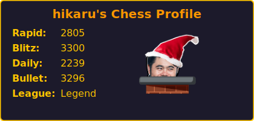
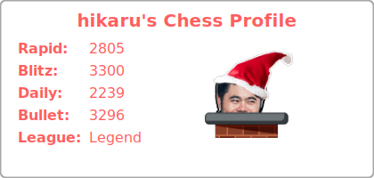
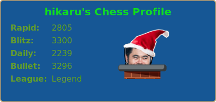
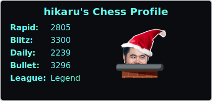

<div align="center">
    <h1>Chess Stats Card</h1>
    Display your chess.com rating on your GitHub profile README.
</div>

## ⚡ Quick setup

1. Star this repo 😁
2. Place the code below in you repo and replace username with your own.
```

```

It is recommended to self-host the project for better reliability. 

## 🃏 Available Cards

Here are the different types of cards you can generate:

| Card Name   | Endpoint    | Description                         | Card |
|------------ |-------------|-------------------------------------| ---- |
| `Card`      | `/api/card` | General profile stats card          |  |
| `Game Card` | `/api/game` | Shows stats for a specific game mode (requires [gameMode](#-additional-options-for-game-card)) |  |


<!-- See Deploying it on your own for more details. -->

## 🔧 Options

> ⚠️ **Important**: Make sure to include the ? before your first parameter, or your options won’t be applied.

Example: `https://chess-stats-card.vercel.app/api/card?user=username`

The `user` field is the only required option for all cards. All other fields are optional. To add additional field add `&[parameter]` to the link.

| Parameter     | Type      | Description                                                              | Example             |
| :-----------: | :-------: | :----------------------------------------------------------------------- | :-----------------: |
| `user`        | `string`  | Your Chess.com username                                                  | magnuscarlsen       |
| `theme`       | `string`  | Card theme – available themes: light, dark, midnight, [etc...](#-themes) | theme=ocean_dark    |
| `width`       | `float`   | Width of the card                                                        | width=420           |
| `height`      | `float`   | Height of the card                                                       | height=200          |
| `avatar`      | `boolean` | Toggle profile picture from Chess.com. `true` by default                 | avatar=false        |
| `textColor`   | `string`  | HEX or named color for body text                                         | textColor=#ffffff   |
| `titleColor`  | `string`  | HEX or named color for the title                                         | titleColor=#00ff00  |
| `borderColor` | `string`  | HEX or named color for the border                                        | borderColor=#000000 |
| `bgColor`     | `string`  | HEX or named color for the card background                               | bgColor=#1a1a1a     |


> **Note**: If you provide `textColor`, `titleColor`, `borderColor`, or `bgColor`, they will override the colors set by the selected `theme`.

### 🎮 Additional Options for `Game Card`

| Parameter     | Type     | Description                                                | Example                |
| :-----------: | :------: | :--------------------------------------------------------- | :--------------------: |
| `gameMode`    | `string` | Game mode to show stats for (**required for `gamecard`**) | gameMode=chess_blitz  |

> Valid `gameMode` values: `chess_rapid`, `chess_blitz`, `chess_bullet`, `chess960_daily` and `chess_daily`.


## 🎨 Themes

All cards themes are set to `default` by default. Here are a few themes that you can do. 

<details>
<summary> All themes </summary>

| | |
| :---: | :---: | 
| `default`  | `transparent`  |
| `shadow_red`  | `shadow_green`  |
| `shadow_blue`  | `dark`  |
| `radical`  | `merko`  |
| `gruvbox`  | `gruvbox_light`  |
| `tokyonight`  | `onedark`  |
| `cobalt`  | `synthwave`  |
| `high_contrast`  | `dracula`  |
| `prussian`  | `monokai`  |
| `vue`  | `vue_dark`  |
| `shades_of_purple`  | `nightowl`  |
| `buefy`  | `blue_green`  |
| `algolia`  | `great_gatsby`  |
| `darcula`  | `bear`  |
| `solarized_dark`  | `solarized_light`  |
| `chartreuse_dark`  | `nord`  |
| `gotham`  | `material_palenight`  |
| `graywhite`  | `vision_friendly_dark`  |
| `ayu_mirage`  | `midnight_purple`  |
| `calm`  | `flag_india`  |
| `omni`  | `react`  |
| `jolly`  | `maroongold`  |
| `yeblu`  | `blueberry`  |
| `slateorange`  | `kacho_ga`  |
| `outrun`  | `ocean_dark`  |
| `city_lights`  | `github_dark`  |
| `github_dark_dimmed`  | `discord_old_blurple`  |
| `aura_dark`  | `panda`  |
| `noctis_minimus`  | `cobalt2`  |
| `swift`  | `aura`  |
| `apprentice`  | `moltack`  |
| `codeSTACKr`  | `rose_pine`  |
| `catppuccin_latte`  | `catppuccin_mocha`  |
| `date_night`  | `one_dark_pro`  |
| `rose`  | `holi`  |
| `neon`  | `blue_navy`  |
| `calm_pink`  | `halloween`  |
| `blood`  | `youtube_dark`  |
| `dawnfox`  | `javascript_dark`  |
| `nightfox`  | `earth`  |
| `soft_green`  | `leafy`  |
| `submarine_flowers`  | `onedark_duo`  |
| `monokai_metallian`  | `tokyonight_duo`  |
| `whatsapp_light`  | `catppuccin_macchiato`  |
| `black_ice`  | `rust_ferris_dark`  |
| `microsoft`  | `codestackr`  |
| `microsoft_dark`  | `taiga`  |
| `dayfox`  | `violet_punch`  |
| `highcontrast`  | `modern_lilac`  |
| `modern_lilac2`  | `burnt_neon`  |
| `sea`  | `hacker_inverted`  |
| `neon_blurange`  | `elegant`  |
| `shadow_orange`  | `holi_theme`  |
| `blux`  | `meta_light`  |
| `windows_dark`  | `hacker`  |
| `green_nur`  | `rising_sun`  |
| `material`  | `shadow_brown`  |
| `git_dark`  | `github_light`  |
| `gruvbox_duo`  | `nordfox`  |
| `buefy_dark`  | `blueberry_duo`  |
| `humoris`  | `horizon`  |
| `whatsapp_light2`  | `neon_dark`  |
| `rust_ferris_light`  | `iceberg`  |
| `telegram`  | `icegray`  |
| `navy_gear`  | `deepblue`  |
| `duskfox`  | `java_dark`  |
| `github_green_purple`  | `github_dark_blue`  |
| `terafox`  | `python_dark`  |
| `dark_smoky`  | `deuteranopia_friend`  |
| `blood_dark`  | `android_dark`  |
| `carbonfox`  | `catppuccin_frappe`  |
| `whatsapp_dark2`  | `meta_dark`  |
| `violet_dark`  | `sea_dark`  |
| `dark_minimalist`  | `travelers_theme`  |

</details>
